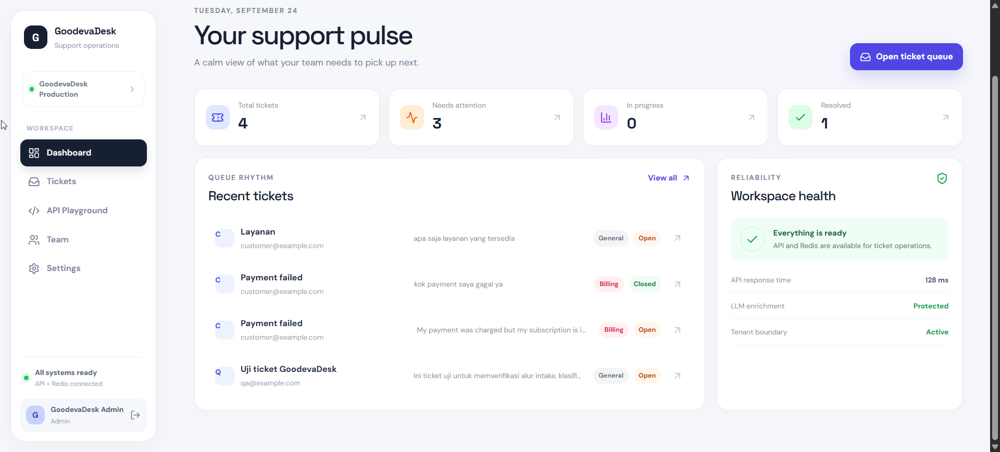

<div align="center">

# GoodevaDesk

### AI-assisted customer support operations

Receive tickets, classify them automatically, generate suggested replies, and manage the entire support workflow from one focused dashboard.

[](https://github.com/Fatihur/goodevadesk/actions/workflows/ci.yml)
[](https://goodevadesk.fatihur.web.id)
[](https://nodejs.org/)
[](https://nestjs.com/)
[](https://react.dev/)

[Live application](https://goodevadesk.fatihur.web.id) · [Swagger API](https://goodevadesk.fatihur.web.id/api/docs) · [GitHub repository](https://github.com/Fatihur/goodevadesk)

</div>

> GoodevaDesk is a multi-tenant customer-support ticketing system built for reliable ticket intake, AI enrichment, and day-to-day support operations.

<p align="center">
  
</p>

## Contents

- [Highlights](#highlights)
- [Architecture](#architecture)
- [API overview](#api-overview)
- [LLM and cache behavior](#llm-and-cache-behavior)
- [Local development](#local-development)
- [Environment variables](#environment-variables)
- [Docker Compose](#docker-compose)
- [Production deployment](#production-deployment)
- [Quality checks](#quality-checks)
- [Security notes](#security-notes)
- [Current limitations](#current-limitations)

## Submission access

The following demo access is intentionally documented for evaluator testing:

| Access | Value |
| --- | --- |
| Application | [goodevadesk.fatihur.web.id](https://goodevadesk.fatihur.web.id) |
| Dashboard email | `admin@goodevadesk.id` |
| Dashboard password | `Goodeva123!` |
| Organization API key | `gd_a9b0d1b7c5c417fd3e0c4555a5b957dd33e7d29c0f20bbc4` |
| Swagger docs | [goodevadesk.fatihur.web.id/api/docs](https://goodevadesk.fatihur.web.id/api/docs) |

The organization API key is used with the `x-api-key` header for integration endpoints. These credentials are provided for this submission environment; rotate them after the evaluation period ends.

## Highlights

- Ticket intake API for external integrations.
- Tenant isolation using organization API keys.
- PostgreSQL persistence with Prisma migrations.
- Redis-backed exact-match cache for LLM enrichment.
- LLM classification into `billing`, `technical`, or `general`.
- Suggested customer replies generated by the configured OpenAI-compatible provider.
- Graceful degradation: a ticket is stored even when the optional LLM provider is unavailable.
- Dashboard authentication with server-side sessions and HttpOnly cookies.
- `admin` and `agent` roles.
- Ticket list, search, filtering, details, status updates, dashboard summary, and team management.
- Health checks, Swagger/OpenAPI documentation, Docker Compose deployment, and CI validation.

## Architecture

```text
                    Public HTTPS
                          |
                    Host Nginx
                 /api/       /
                   |         |
             NestJS API    React web
             127.0.0.1:3005  127.0.0.1:8085
                   |
          +--------+---------+
          |                  |
      PostgreSQL           Redis
      persistent data      LLM cache
```

The production host keeps PostgreSQL and Redis on the private Docker Compose network. Only the API and web container ports are bound to localhost; host Nginx handles the public domain and TLS.

The repository is an npm workspace:

- `api` — NestJS, Prisma, authentication, ticket and dashboard APIs.
- `web` — React, Vite, React Router, and the operations dashboard.
- `deploy/nginx` — Nginx configuration templates used by the VPS deployment.

### Stack at a glance

| Layer | Technology | Responsibility |
| --- | --- | --- |
| Frontend | React + Vite | Ticket dashboard and team operations |
| Backend | NestJS + TypeScript | Authentication, tickets, dashboard, and integrations |
| Data | PostgreSQL + Prisma | Tenants, users, sessions, and tickets |
| Cache | Redis | Exact-match LLM enrichment cache |
| AI | OpenAI-compatible provider | Ticket category and suggested reply |
| Delivery | Docker Compose + Nginx | Reproducible deployment and HTTPS routing |

## API overview

### Public integration API

Integration requests use the tenant API key in the `x-api-key` header.

| Method | Endpoint | Purpose |
| --- | --- | --- |
| POST | `/api/tickets` | Create a ticket and optionally enrich it with the LLM |
| GET | `/api/tickets` | List tickets for the authenticated tenant |
| GET | `/api/tickets/:id` | Read one ticket for the authenticated tenant |
| PATCH | `/api/tickets/:id/status` | Update a ticket status |
| GET | `/api/health` | Check API, database, and Redis dependencies |
| GET | `/api/docs` | Open Swagger UI |

Create a ticket:

```bash
curl -X POST https://goodevadesk.fatihur.web.id/api/tickets \
  -H "Content-Type: application/json" \
  -H "x-api-key: YOUR_ORGANIZATION_API_KEY" \
  -d '{
    "customer_email": "customer@example.com",
    "subject": "Cannot download my invoice",
    "message": "The invoice download returns an error."
  }'
```

Ticket list queries support:

- `status`
- `category`
- `page` and `limit`
- `search` across subject, customer email, and message

### Dashboard API

Dashboard requests authenticate through the session cookie created by `POST /api/auth/login`.

| Method | Endpoint | Access |
| --- | --- | --- |
| POST | `/api/auth/login` | Public login |
| POST | `/api/auth/logout` | Authenticated users |
| GET | `/api/auth/me` | Authenticated users |
| GET | `/api/dashboard/summary` | Authenticated users |
| GET | `/api/users` | Admin only |
| POST | `/api/users` | Admin only |

The API returns camelCase response fields such as `customerEmail` and `suggestedReply`. The ticket creation request follows the integration contract and accepts `customer_email`, `subject`, and `message`.

## LLM and cache behavior

The LLM adapter supports an OpenAI-compatible endpoint. The production deployment uses Kenari with the configured model, while local development can use any compatible provider or disable enrichment.

For each new ticket:

1. The ticket is persisted first.
2. The subject and message are normalized.
3. Redis is checked using a versioned SHA-256 cache key.
4. On a cache miss, the API asks the provider for JSON containing `category` and `suggestedReply`.
5. The JSON is parsed and validated with Zod before it is stored.
6. Retryable network, rate-limit, and server errors are retried with bounded exponential backoff.
7. Provider or validation failures leave the ticket available with null enrichment fields.

The cache key is based on the normalized subject and message, not on a customer identity. The default cache TTL is 2,592,000 seconds (30 days) and can be changed with `CACHE_TTL_SECONDS`.

## Local development

### Requirements

- Node.js 22 or newer
- npm
- Docker Desktop, or local PostgreSQL and Redis services
- An OpenAI-compatible LLM endpoint is optional

### Install and configure

PowerShell:

```powershell
git clone https://github.com/Fatihur/goodevadesk.git
cd goodevadesk
Copy-Item .env.example .env
npm install
```

macOS/Linux:

```bash
git clone https://github.com/Fatihur/goodevadesk.git
cd goodevadesk
cp .env.example .env
npm install
```

Start dependencies with Docker Compose:

```bash
docker compose up -d postgres redis
npm run db:generate
npm run db:migrate
npm run db:seed
npm run dev
```

The development servers are:

- Web dashboard: http://localhost:5173
- API: http://localhost:3000
- Swagger UI: http://localhost:3000/api/docs

The development seed creates demo organizations and users. Production seeding is controlled by `SEED_PRODUCTION` and the `SEED_ADMIN_*` variables; never put production credentials in the repository.

## Environment variables

Copy `.env.example` to `.env` and adjust the values for the target environment.

| Variable | Purpose |
| --- | --- |
| `NODE_ENV` | Runtime environment |
| `PORT` | API port; defaults to `3000` |
| `DATABASE_URL` | PostgreSQL connection string |
| `REDIS_HOST`, `REDIS_PORT` | Redis connection |
| `REDIS_PASSWORD` | Redis authentication |
| `AI_PROVIDER` | Provider mode, such as `custom` or `kenari` |
| `AI_BASE_URL` | OpenAI-compatible API base URL |
| `AI_API_KEY` | LLM provider secret |
| `AI_MODEL` | LLM model identifier |
| `LLM_TIMEOUT_MS` | LLM request timeout |
| `CACHE_TTL_SECONDS` | Redis enrichment cache TTL |
| `CACHE_VERSION` | Cache namespace version for safe invalidation |
| `SESSION_SECRET` | Secret used to protect dashboard sessions |
| `SESSION_TTL_SECONDS` | Session lifetime |
| `CORS_ORIGIN` | Allowed dashboard origin |
| `VITE_API_BASE_URL` | API base URL used by the web app |

For production-only seeding, use `SEED_PRODUCTION`, `SEED_ADMIN_EMAIL`, `SEED_ADMIN_PASSWORD`, `SEED_ADMIN_NAME`, `SEED_ORG_NAME`, and `SEED_ORG_API_KEY` on the server. Remove or rotate temporary seed credentials after first login.

## Docker Compose

Build and start the full stack locally:

```bash
docker compose build
docker compose up -d
docker compose ps
```

Useful diagnostics:

```bash
docker compose logs -f api
docker compose logs -f web
docker compose exec api npx prisma migrate status
```

The named volumes `postgres_data` and `redis_data` preserve service data. Removing volumes is destructive and should only be done intentionally.

## Production deployment

The live deployment runs from `/opt/goodevadesk` on the VPS. Host Nginx serves `goodevadesk.fatihur.web.id`, proxies `/api/` to the API container, and proxies the web application to the web container.

Deploy the current `main` branch:

```bash
ssh atlantic
cd /opt/goodevadesk
git pull --ff-only origin main
docker compose build
docker compose run --rm api npx prisma migrate deploy
docker compose up -d
docker compose ps
curl -fsS https://goodevadesk.fatihur.web.id/api/health
```

When only server environment values change, restart the affected service after updating the server-side `.env`:

```bash
docker compose up -d --force-recreate api
docker compose ps
```

The deployment checklist is:

1. Confirm the target commit is present on the server.
2. Build the API and web images.
3. Apply Prisma migrations before starting the new application version.
4. Recreate the services.
5. Confirm container health and `/api/health`.
6. Run an authenticated login or ticket smoke test when the release changes those flows.
7. Inspect logs if health checks or smoke tests fail.

For rollback, check out a known-good commit on the server, rebuild the affected image, run the compatible migration procedure, and recreate the services. Database migrations should be designed to remain compatible with the previous application version before a rollback is attempted.

## Quality checks

Run the local quality gate before pushing:

```bash
npm run lint
npm run typecheck
npm run build
npm test
```

The GitHub Actions workflow in `.github/workflows/ci.yml` installs dependencies, generates Prisma Client, runs type checking, builds both workspaces, and runs the test suite.

Current tests cover core API behavior and LLM/cache paths. Add broader integration and end-to-end coverage as the product surface grows.

## Security notes

- Never commit `AI_API_KEY`, database passwords, Redis passwords, `SESSION_SECRET`, or private production credentials. The submission credentials above are intentionally public and must be treated as disposable.
- Keep production `.env` only on the server or in a dedicated secret manager.
- Use HTTPS for dashboard and integration traffic.
- Keep PostgreSQL and Redis private; they should not be exposed directly to the internet.
- Rotate API keys, session secrets, and admin passwords if they are ever exposed.
- Treat ticket subject and message content as untrusted input. The LLM prompt explicitly asks the model to return only the required schema.

## Current limitations

- Admin team management currently supports listing and creating users; update and delete workflows are not implemented.
- There is no built-in rate limiter yet.
- Request logging and operational observability are intentionally lightweight.
- The Playground endpoint registry is manually maintained.
- Billing, subscriptions, queue workers, vector search, customer self-service, and realtime chat are outside the current scope.

## License

No open-source license has been selected yet. Until a license is added, treat the repository as source-available for evaluation and follow the repository owner's usage instructions.

## Contributing

Create a focused branch, run the quality checks, and open a pull request with a clear description of the behavior change. Keep secrets out of commits, screenshots, logs, and issue reports.
